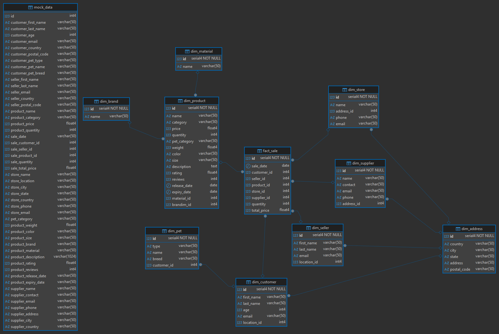

# BigDataSnowflake
Инструкция для запуска:
1. Запустить ```git clone https://github.com/Ecodrin/BDSnowflake.git```
2. Запустить ```docker compose up```
3. Создать соединение в dbeaver с параметрами user: "postgres", password: "123", база данных: "postgres", порт: "5432".

Файловая структура лабораторной работы:
```
C:.
│   docker-compose.yml
│   README.md
│   snowflake.png
│
├───scripts
│       1_ddl.sql
│       2_dml.sql
│
└───src_data
        MOCK_DATA (1).csv
        MOCK_DATA (2).csv
        MOCK_DATA (3).csv
        MOCK_DATA (4).csv
        MOCK_DATA (5).csv
        MOCK_DATA (6).csv
        MOCK_DATA (7).csv
        MOCK_DATA (8).csv
        MOCK_DATA (9).csv
        MOCK_DATA.csv
```

